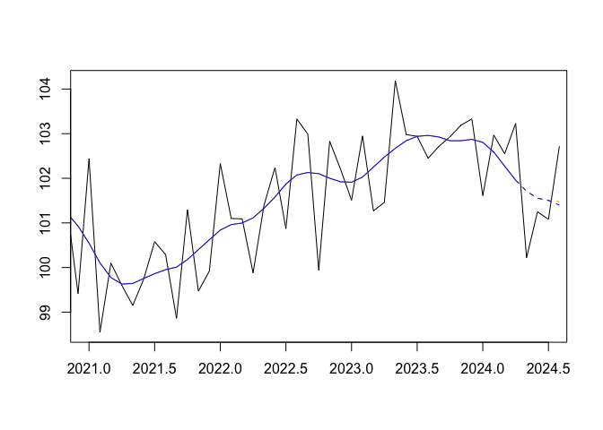
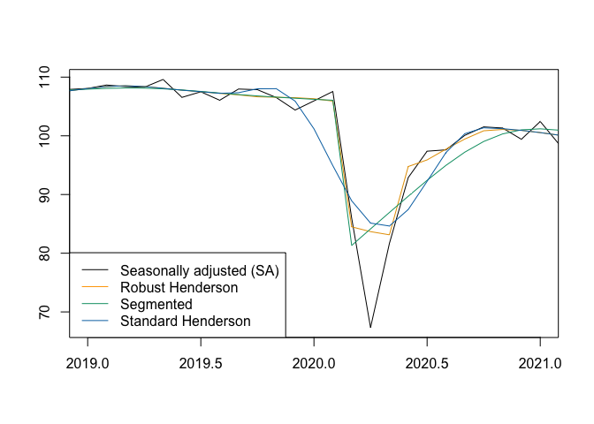

<!-- README.md is generated from README.Rmd. Please edit that file -->

# publishTC 

<!-- badges: start -->

[](https://aqlt.r-universe.dev/publishTC)
[](https://CRAN.R-project.org/package=publishTC)
<!-- [](https://github.com/AQLT/publishTC/actions/workflows/R-CMD-check.yaml) -->
<!-- badges: end -->

Why not publish the trend-cycle?

The goal of **`publishTC`** is to facilitate the computation,
evaluation, and visualization of trend-cycle components from time series
using modern state-of-the-art methodology:

- Using the **Cascade Linear Filter (CLF)** and surrogate
  cut-and-normalise asymmetric filters, as done by Statistics Canada
  (Dagum and Luati 2008);
- Using the classical **Henderson symmetric filter** and surrogate
  Musgrave asymmetric filters, as done by the Australian Bureau of
  Statistics (Trewin 2003);
- Using a **local parametrization** of Musgrave asymmetric filters
  (Quartier-la-Tente 2024);
- Extending Henderson filters to take into account **additive outliers
  (AO)** and **level shifts (LS)** (Quartier-la-Tente 2025).

## Installation

To install `publishTC`:

    install.packages('publishTC', repos = c('https://aqlt.r-universe.dev', 'https://cloud.r-project.org'))

## Quick Start

``` r
library(publishTC)
```

### 1. Trend-Cycle Estimation

Estimate the trend-cycle component using the standard Henderson filter:

``` r
# Example dataset: French Industrial Production Index
x <- french_ipi[, "manufacturing"]

# Compute Henderson trend-cycle estimates
tc_hend <- henderson_smoothing(x, length = 13)

# Summary diagnostics (I/C ratio, MCD, filter length)
summary(tc_hend)
#> $`I/C ratio`
#> [1] 3.318081
#> 
#> $`I/C ratios`
#>  [1] 3.3180811 1.6933861 1.0927936 0.8358296 0.6684998 0.5812624 0.5760156
#>  [8] 0.5072746 0.4796632 0.4476804 0.4014496 0.4138149
#> 
#> $MCD
#> [1] 4
#> 
#> $Length
#> [1] 13
```

### 2. Multi-Method Comparison

Compare different trend-cycle estimation approaches on the same series:

``` r
# Estimate trend using multiple methods
all_tc <- smoothing(x)

# Plot comparison
plot(all_tc$henderson, xlim = c(2021, 2024.5))
lines(all_tc$henderson_localic, col_tc = "blue")
```



### 3. Outlier-Robust & Segmented Smoothing

Account for Additive Outliers (AO) and Level Shifts (LS) during
estimation:

``` r
# Identify outliers using RegARIMA wrapper
outliers <- x13_regarima_outliers(x)

# Compute robust Henderson trend-cycle estimates
tc_robust <- henderson_robust_smoothing(
  x, 
  ao = outliers$ao, 
  ls = outliers$ls, 
  local_icr = TRUE
)

# Segmented smoothing around a structural break
tc_seg <- segmented_smoothing(
  x, 
  breaks = list(c(2020, 3)), 
  break_method = "two-sides"
)
plot(tc_robust, xlim = c(2019, 2021))
lines(tc_seg, col_tc = "#009E73")
lines(tc_hend, col_tc = "#0072B2")
legend(
  "bottomleft",
  legend = c("Seasonally adjusted (SA)", "Robust Henderson", "Segmented", "Standard Henderson"),
  col = c("black", "orange", "#009E73", "#0072B2"),
  lty = 1
)
```



### 4. Turning Point & Ripple Diagnostics

Identify economic turning points and short-term unwanted ripples:

``` r
# Find turning points (upturns and downturns)
tp <- turning_points(tc_hend)
tp
#> $upturn
#>  [1] 1990.667 1991.333 1993.750 1995.833 1998.917 2001.833 2002.833 2003.417
#>  [9] 2004.417 2005.333 2006.583 2007.667 2009.167 2012.833 2013.583 2014.667
#> [17] 2016.333 2018.083 2019.500 2020.250 2021.167 2022.917
#> 
#> $downturn
#>  [1] 1990.917 1991.833 1995.000 1998.417 2001.000 2002.167 2004.167 2004.833
#>  [9] 2006.333 2007.333 2008.000 2011.083 2013.167 2013.917 2015.833 2017.750
#> [17] 2019.083 2019.750 2020.667 2022.583 2023.500
# Count unwanted ripples (cycles under 11 months)
ripples <- unwanted_ripples(tc_hend)
ripples
#> [1] 30
```

## Main Functions Overview

| Category | Main Functions |
|:---|:---|
| **Estimation** | `henderson_smoothing()`, `clf_smoothing()`, `henderson_robust_smoothing()`, `segmented_smoothing()`, `smoothing()` |
| **Diagnostics** | `icr()`, `icrs()`, `mcd()`, `smoothness()`, `bandwidth()`, `turning_points()`, `unwanted_ripples()`, `implicit_forecasts()`, `underlying_forecasts()` |
| **Visualization** (base R) | `plot()`, `lines()`, `lollypop()`, `implicit_forecasts_plot()`, `confint_plot()`, `growthplot()`, `implicit_forecasts_plot()`, `underlying_forecasts_plot()` |
| **Visualization** (ggplot2) | `autoplot()`, `gglollypop()`, `ggconfint_plot()`, `ggsmoothing_plot()`, `gggrowthplot()`, `ggimplicit_forecasts_plot()`, `ggunderlying_forecasts_plot()` |
| **Utilities** | `write.ts()`, `read.ts()`, `x13_regarima_outliers()` |

## References

- **Dagum, E. B., & Luati, A. (2008).** A Cascade Linear Filter to
  Reduce Revisions and False Turning Points for Real Time Trend-Cycle
  Estimation. *Econometric Reviews*, 28(1-3), 40‑59.
  <https://doi.org/10.1080/07474930802387837>
- **Henderson, R. (1916).** Note on graduation by adjusted average.
  *Transactions of the Actuarial Society of America*, 17, 43‑48.
- **Musgrave, J. (1964).** A set of end weights to end all end weights.
  *US Census Bureau \[custodian\]*.
- **Quartier-la-Tente, A. (2024).** Improving Real-Time Trend Estimates
  Using Local Parametrization of Polynomial Regression Filters. *Journal
  of Official Statistics*, 40(4), 685-715.
  <https://doi.org/10.1177/0282423X241283207>
- **Quartier-la-Tente, A. (2025).** Estimation de la tendance-cycle avec
  des méthodes robustes aux points atypiques.
  <https://github.com/AQLT/robustMA>
- **Trewin, D. (2003).** A guide to interpreting time series -
  Monitoring trends. *Australian Bureau of Statistics Information
  Paper*.
  <https://www.abs.gov.au/AUSSTATS/abs@.nsf/Lookup/1349.0Main+Features12003?OpenDocument>
